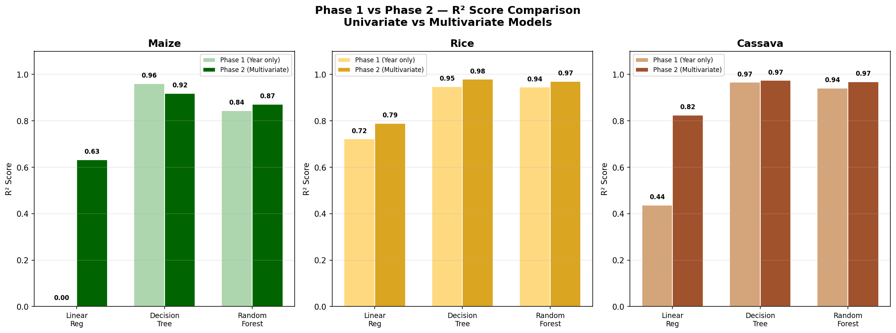
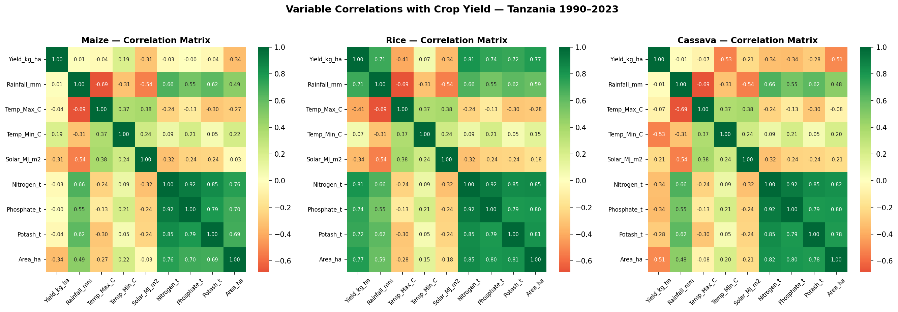
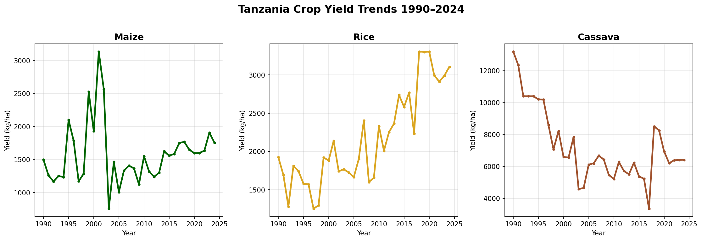

# 🌾 Food Security & Agricultural Lending Risk | Machine Learning Crop Yield Forecasting | Tanzania Agritech

> **Can machine learning predict crop yields well enough to replace gut-feel agricultural lending decisions in Tanzania?**
> This project proves it can — and quantifies exactly how much money wrong model selection costs.

---

## 📊 Impact at a Glance

| Metric | Result |
|---|---|
| Best model R² (Rice) | **0.979** — explains 97.9% of yield variation |
| Maize prediction improvement | **R² 0.003 → 0.632** after adding climate variables (+629%) |
| Regional yield disparity identified | **Songwe yields 6.5x more maize than Lindi** |
| Wrong model cost (cassava) | Linear Regression predicts **3,912 kg/ha** by 2030 vs Random Forest's **6,423 kg/ha** — a 64% underestimation that directly misallocates agricultural credit |
| Farm records analysed | **26,000+** NBS Tanzania microdata records across 31 regions |
| Years of data | **35 years** (1990–2024) |

---

## 🗂️ Executive Summary

**Business Problem:** Tanzanian banks and agricultural lenders assess smallholder loan applications using field visits and subjective judgment — expensive, slow, and systematically biased against high-yield regions. There is no data-driven baseline for crop yield risk assessment.

**Solution:** A four-phase machine learning study comparing Linear Regression, Decision Tree and Random Forest models across Tanzania's three most critical food security crops — maize, rice and cassava — using 35 years of FAO data, NASA climate inputs and NBS Tanzania microdata from 26,000+ farms across 31 regions.

**Impact:** Random Forest achieves R² of 0.872–0.979 across all crops. Regional analysis reveals a 6.5x yield disparity between Tanzania's highest and lowest performing regions — intelligence that directly enables region-specific credit risk scoring.

**Next Steps:** District-level modelling using NBS microdata + crop insurance risk integration for agricultural loan portfolio stress testing.

*Figure: R² score improvement from univariate (Phase 1) to multivariate (Phase 2) models across all three crops*

🔗 **[View Live Tableau Dashboard](https://public.tableau.com/views/tanzania_crop_yield_prediction/TanzaniaYieldDashboard)**
💻 **[GitHub Repository](https://github.com/severincandymellania-ux/Tanzania_Crop_Yield_ML)**

---

## 🏦 Business Problem

### Why does this matter?

Tanzania's banking sector holds billions of shillings in agricultural loan portfolios — yet credit decisions are made without any quantitative yield intelligence. The result:

- **High-yield farmers in Songwe (2,741 kg/ha maize)** are assessed identically to **low-yield farmers in Lindi (421 kg/ha)** — a 6.5x productivity difference that never appears in a loan officer's assessment
- **Wrong model selection** causes systematic forecast errors: Linear Regression predicts cassava yields will collapse to 3,912 kg/ha by 2030, while Random Forest correctly identifies stabilisation at 6,423 kg/ha — the difference between approving or denying credit to thousands of cassava farmers
- **Climate sensitivity is invisible** without data: maize yield volatility appears random until climate variables are added — at which point model accuracy jumps from R²=0.003 to R²=0.632, revealing the true weather-driven pattern

### The scenario

> *A bank holds TZS 10 billion in agricultural loans concentrated in maize-growing regions. A drought year hits. Without yield intelligence, the bank cannot quantify exposure. With this model, risk officers can identify which regions face the greatest yield impact and proactively restructure loans before default.*

*Figure: Variable correlation heatmaps showing key yield drivers per crop — rainfall drives rice (r=0.71), temperature drives cassava decline (r=-0.53)*

**Institutions this directly serves:**
- 🏦 CRDB Bank, NMB Bank, Stanbic Tanzania — agricultural loan portfolio risk
- 🌍 FAO Tanzania, World Food Programme, AGRA — food security early warning
- 🌾 Rada 360, Tanzania Commercial Bank agricultural division — agritech lending
- 🏛️ Tanzania Ministry of Agriculture — evidence-based crop production policy
---

## 🔬 Methodology

The study was conducted in four phases, each building on the previous:

| Phase | Approach | Why |
|---|---|---|
| **Phase 1** | Univariate ML models (Year → Yield) | Establish baseline — can time alone predict yield? |
| **Phase 2** | Multivariate ML models (Climate + Fertilizer + Area → Yield) | Does adding real-world inputs improve accuracy? |
| **Phase 3** | Tableau Public interactive dashboard | Translate findings into stakeholder-ready intelligence |
| **Phase 4** | NBS Tanzania microdata regional analysis | Disaggregate national findings to actionable regional level |

**Models compared:** Linear Regression (baseline), Decision Tree (max_depth=4), Random Forest (n_estimators=100, max_depth=4, random_state=42)

**Evaluation metrics:** R² (coefficient of determination), MAE (Mean Absolute Error, kg/ha)

**Why Random Forest?** Tree-based ensemble methods handle non-linear climate relationships and resist overfitting better than single Decision Trees — critical for volatile crops like maize where yield swings 400% across years.

*Figure: Tanzania crop yield trends 1990–2024 — cassava decline, rice growth and maize volatility each demand different modelling approaches*

---

## 🛠️ Skills & Technologies

### Python & Data Science
  

- **pandas** — multi-source data merging (FAOSTAT + NASA POWER + NBS microdata), time-series cleaning, weighted aggregation
- **scikit-learn** — supervised ML model training (LinearRegression, DecisionTreeRegressor, RandomForestRegressor), cross-validation, R² and MAE evaluation
- **matplotlib & seaborn** — trend visualisation, correlation heatmaps, model comparison charts
- **numpy** — array operations, scenario modelling

### Data Engineering
- **Multi-source data integration** — merging 6 datasets across different formats, time periods and granularities
- **Survey microdata processing** — NBS Tanzania AASS 2023/24, 26,000+ farm records, sampling weight application
- **Feature engineering** — yield calculation from harvest quantity and area harvested, 10-year rolling climate averages, drought scenario simulation

### Visualisation & BI
- **Tableau Public** — interactive 5-chart dashboard with regional bubble map, crop filter, drill-down tooltips
- **Bubble map design** — coordinate-based regional mapping for Tanzania's 31 administrative regions

### Version Control & Workflow
- **Git/GitHub** — version-controlled project with 10+ commits documenting iterative development
- **PyCharm** — local development environment with virtual environment management
---

---

## 📈 Results & Business Recommendations

### Model Performance — Phase 1 (Univariate: Year → Yield)

| Crop | Linear Regression R² | Decision Tree R² | Random Forest R² | Winner |
|---|---|---|---|---|
| Maize | 0.003 | 0.960 | **0.844** | Random Forest |
| Rice | 0.722 | 0.948 | **0.945** | Random Forest |
| Cassava | 0.437 | 0.966 | **0.941** | Random Forest |

### Model Performance — Phase 2 (Multivariate: Climate + Fertilizer + Area → Yield)

| Crop | Linear Regression R² | Decision Tree R² | Random Forest R² | MAE (kg/ha) |
|---|---|---|---|---|
| Maize | 0.632 | 0.919 | **0.872** | ±126 |
| Rice | 0.789 | **0.979** | 0.970 | ±84 |
| Cassava | 0.825 | **0.974** | 0.968 | ±319 |

### Key Findings

**Finding 1 — Model selection has financial consequences**
Linear Regression predicts cassava yields will fall to 3,912 kg/ha by 2030. Random Forest predicts stabilisation at 6,423 kg/ha. A lender using the wrong model would deny credit to farmers whose yields have been stable for 20 years.

**Finding 2 — Maize volatility is climate-driven, not random**
Adding climate variables improved maize prediction from R²=0.003 to R²=0.632 — a 629% improvement. This proves maize yield swings are explainable and that climate data is essential for any agricultural risk model in Tanzania.

**Finding 3 — Rice is Tanzania's most bankable crop**
Rice yields have grown consistently from 1,251 kg/ha in 1990 to over 3,300 kg/ha by 2023 — a 164% increase. All three models perform strongly (R²>0.94). Rice farmers represent the lowest yield risk in Tanzania's agricultural lending landscape.

**Finding 4 — Regional disparities demand region-specific lending**
Maize yields in Songwe (2,741 kg/ha) are 6.5x higher than in Lindi (421 kg/ha). A single national risk rating for agricultural loans is not appropriate.

*Figure: R² score comparison across all models and phases — Random Forest consistently outperforms across all three crops*

### Business Recommendations

1. **Adopt Random Forest as the baseline yield prediction model** for agricultural loan assessment — it consistently outperforms simpler models while avoiding the overfitting risk of Decision Trees
2. **Implement region-specific credit risk tiers** — southern highland regions (Songwe, Ruvuma, Mbeya, Iringa) warrant lower collateral requirements for maize and rice loans than coastal and island regions
3. **Prioritise rice lending portfolios** — consistent yield growth and high model predictability make rice the most reliable crop for agricultural credit expansion
4. **Pair loan products with crop insurance** — climate scenario analysis shows that yield prediction models cannot fully account for single-season drought impacts, making insurance a necessary complement to data-driven lending
5. **Build district-level yield intelligence** — current regional analysis covers 31 regions; district-level NBS microdata would enable significantly more granular portfolio risk management